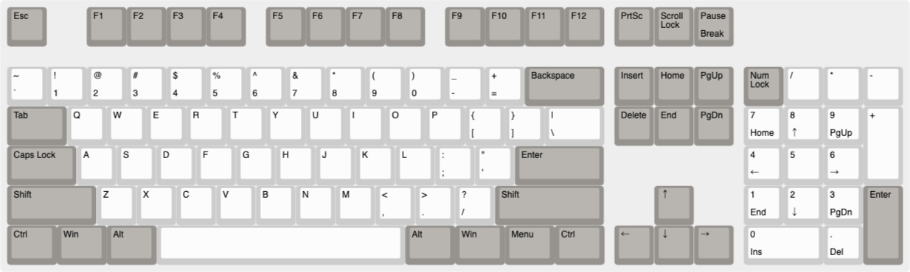
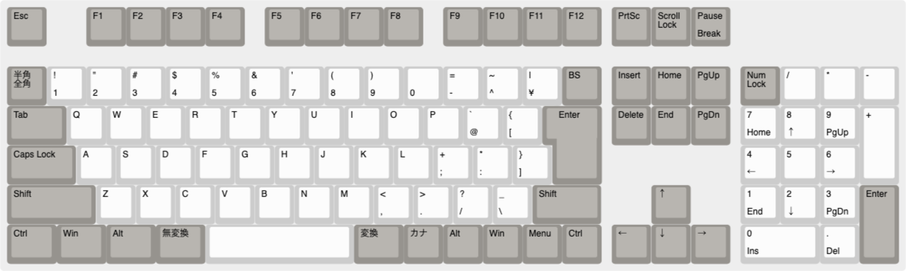
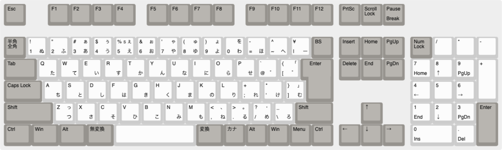
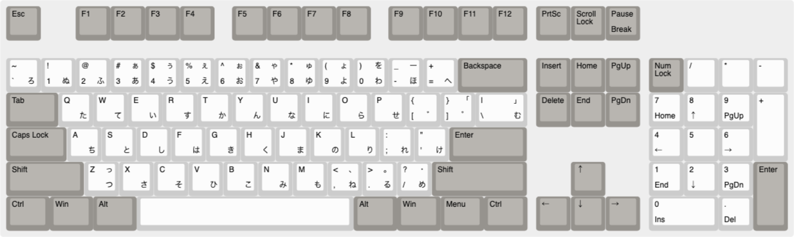
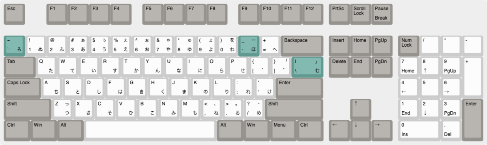
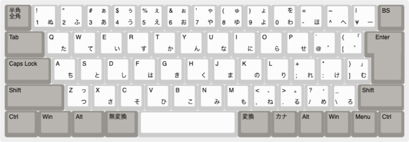
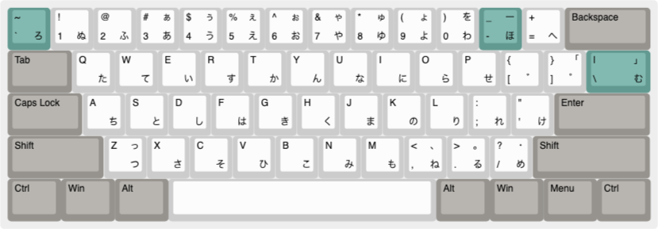
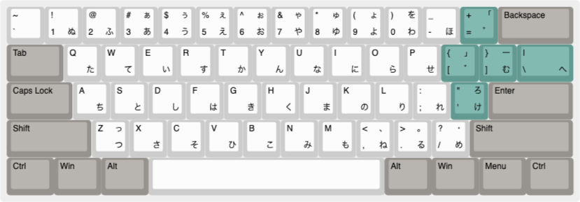

# Keyboard layouts

The images are generated by [keyboard-layout-editor](http://keyboard-layout-editor.com).

## US keyboard (ANSI 104)

[KLE](http://www.keyboard-layout-editor.com/##@@_c=%2396938e%3B&=Esc&_x:1%3B&=F1&=F2&=F3&=F4&_x:0.5%3B&=F5&=F6&=F7&=F8&_x:0.5%3B&=F9&=F10&=F11&=F12&_x:0.25%3B&=PrtSc&=Scroll%20Lock&=Pause%0ABreak%3B&@_y:0.5&c=%23cccccc%3B&=~%0A%60&=!%0A1&=%2F@%0A2&=%23%0A3&=$%0A4&=%25%0A5&=%5E%0A6&=%2F&%0A7&=*%0A8&=(%0A9&=)%0A0&=%2F_%0A-&=+%0A%2F=&_w:2&c=%2396938e%3B&=Backspace&_x:0.25%3B&=Insert&=Home&=PgUp&_x:0.25%3B&=Num%20Lock&_c=%23cccccc%3B&=%2F%2F&=*&=-%3B&@_w:1.5&c=%2396938e%3B&=Tab&_c=%23cccccc%3B&=Q&=W&=E&=R&=T&=Y&=U&=I&=O&=P&=%7B%0A%5B&=%7D%0A%5D&_w:1.5%3B&=%7C%0A%5C&_x:0.25&c=%2396938e%3B&=Delete&=End&=PgDn&_x:0.25&c=%23cccccc%3B&=7%0AHome&=8%0A%E2%86%91&=9%0APgUp&_h:2%3B&=+%3B&@_w:1.75&c=%2396938e%3B&=Caps%20Lock&_c=%23cccccc%3B&=A&=S&=D&=F&=G&=H&=J&=K&=L&=%2F:%0A%2F%3B&=%22%0A'&_w:2.25&c=%2396938e%3B&=Enter&_x:3.5&c=%23cccccc%3B&=4%0A%E2%86%90&=5&=6%0A%E2%86%92%3B&@_w:2.25&c=%2396938e%3B&=Shift&_c=%23cccccc%3B&=Z&=X&=C&=V&=B&=N&=M&=%3C%0A,&=%3E%0A.&=%3F%0A%2F%2F&_w:2.75&c=%2396938e%3B&=Shift&_x:1.25%3B&=%E2%86%91&_x:1.25&c=%23cccccc%3B&=1%0AEnd&=2%0A%E2%86%93&=3%0APgDn&_h:2&c=%2396938e%3B&=Enter%3B&@_w:1.25&c=%2396938e%3B&=Ctrl&_w:1.25%3B&=Win&_w:1.25%3B&=Alt&_a:7&w:6.25&c=%23cccccc%3B&=&_a:4&w:1.25&c=%2396938e%3B&=Alt&_w:1.25%3B&=Win&_w:1.25%3B&=Menu&_w:1.25%3B&=Ctrl&_x:0.25%3B&=%E2%86%90&=%E2%86%93&=%E2%86%92&_x:0.25&w:2&c=%23cccccc%3B&=0%0AIns&=.%0ADel)

## Japanese keyboard (OADG 109A)

[KLE](http://www.keyboard-layout-editor.com/##@@_c=%2396938e%3B&=Esc&_x:1%3B&=F1&=F2&=F3&=F4&_x:0.5%3B&=F5&=F6&=F7&=F8&_x:0.5%3B&=F9&=F10&=F11&=F12&_x:0.25%3B&=PrtSc&=Scroll%20Lock&=Pause%0ABreak%3B&@_y:0.5%3B&=%E5%8D%8A%E8%A7%92%E3%80%80%E5%85%A8%E8%A7%92&_c=%23cccccc%3B&=!%0A1&=%22%0A2&=%23%0A3&=$%0A4&=%25%0A5&=%2F&%0A6&='%0A7&=(%0A8&=)%0A9&=%0A0&=%2F=%0A-&=~%0A%5E&=%7C%0A%C2%A5&_c=%2396938e%3B&=BS&_x:0.25%3B&=Insert&=Home&=PgUp&_x:0.25%3B&=Num%20Lock&_c=%23cccccc%3B&=%2F%2F&=*&=-%3B&@_w:1.5&c=%2396938e%3B&=Tab&_c=%23cccccc%3B&=Q&=W&=E&=R&=T&=Y&=U&=I&=O&=P&=%60%0A%2F@&=%7B%0A%5B&_x:0.25&w:1.25&h:2&w2:1.5&h2:1&x2:-0.25&c=%2396938e%3B&=Enter&_x:0.25%3B&=Delete&=End&=PgDn&_x:0.25&c=%23cccccc%3B&=7%0AHome&=8%0A%E2%86%91&=9%0APgUp&_h:2%3B&=+%3B&@_w:1.75&c=%2396938e%3B&=Caps%20Lock&_c=%23cccccc%3B&=A&=S&=D&=F&=G&=H&=J&=K&=L&=+%0A%2F%3B&=*%0A%2F:&=%7D%0A%5D&_x:4.75%3B&=4%0A%E2%86%90&=5&=6%0A%E2%86%92%3B&@_w:2.25&c=%2396938e%3B&=Shift&_c=%23cccccc%3B&=Z&=X&=C&=V&=B&=N&=M&=%3C%0A,&=%3E%0A.&=%3F%0A%2F%2F&=%2F_%0A%5C&_c=%2396938e&w:1.75%3B&=Shift&_x:1.25%3B&=%E2%86%91&_x:1.25&c=%23cccccc%3B&=1%0AEnd&=2%0A%E2%86%93&=3%0APgDn&_h:2&c=%2396938e%3B&=Enter%3B&@_w:1.25%3B&=Ctrl&_w:1.25%3B&=Win&_w:1.25%3B&=Alt&_w:1.25%3B&=%E7%84%A1%E5%A4%89%E6%8F%9B&_w:3.75&c=%23cccccc%3B&=&_a:4&w:1.25&c=%2396938e%3B&=%E5%A4%89%E6%8F%9B&=%E3%82%AB%E3%83%8A&=Alt&=Win&=Menu&=Ctrl&_x:0.25%3B&=%E2%86%90&=%E2%86%93&=%E2%86%92&_x:0.25&w:2&c=%23cccccc%3B&=0%0AIns&=.%0ADel)

## Japanese keyboard (OADG 109A) with Kana input

[KLE](http://www.keyboard-layout-editor.com/##@@_c=%2396938e%3B&=Esc&_x:1%3B&=F1&=F2&=F3&=F4&_x:0.5%3B&=F5&=F6&=F7&=F8&_x:0.5%3B&=F9&=F10&=F11&=F12&_x:0.25%3B&=PrtSc&=Scroll%20Lock&=Pause%0ABreak%3B&@_y:0.5%3B&=%E5%8D%8A%E8%A7%92%E3%80%80%E5%85%A8%E8%A7%92&_c=%23cccccc%3B&=!%0A1%0A%0A%E3%81%AC&=%22%0A2%0A%0A%E3%81%B5&=%23%0A3%0A%E3%81%81%0A%E3%81%82&=$%0A4%0A%E3%81%85%0A%E3%81%86&=%25%0A5%0A%E3%81%87%0A%E3%81%88&=%2F&%0A6%0A%E3%81%89%0A%E3%81%8A&='%0A7%0A%E3%82%83%0A%E3%82%84&=(%0A8%0A%E3%82%85%0A%E3%82%86&=)%0A9%0A%E3%82%87%0A%E3%82%88&=%0A0%0A%E3%82%92%0A%E3%82%8F&=%2F=%0A-%0A%0A%E3%81%BB&=~%0A%5E%0A%0A%E3%81%B8&=%7C%0A%C2%A5%0A%0A%E3%83%BC&_c=%2396938e%3B&=BS&_x:0.25%3B&=Insert&=Home&=PgUp&_x:0.25%3B&=Num%20Lock&_c=%23cccccc%3B&=%2F%2F&=*&=-%3B&@_c=%2396938e&w:1.5%3B&=Tab&_c=%23cccccc%3B&=Q%0A%0A%0A%E3%81%9F&=W%0A%0A%0A%E3%81%A6&=E%0A%0A%0A%E3%81%84&=R%0A%0A%0A%E3%81%99&=T%0A%0A%0A%E3%81%8B&=Y%0A%0A%0A%E3%82%93&=U%0A%0A%0A%E3%81%AA&=I%0A%0A%0A%E3%81%AB&=O%0A%0A%0A%E3%82%89&=P%0A%0A%0A%E3%81%9B&=%60%0A%2F@%0A%0A%E3%82%9B&=%7B%0A%5B%0A%E3%80%8C%0A%E3%82%9C&_x:0.25&c=%2396938e&w:1.25&h:2&w2:1.5&h2:1&x2:-0.25%3B&=Enter&_x:0.25%3B&=Delete&=End&=PgDn&_x:0.25&c=%23cccccc%3B&=7%0AHome&=8%0A%E2%86%91&=9%0APgUp&_h:2%3B&=+%3B&@_c=%2396938e&w:1.75%3B&=Caps%20Lock&_c=%23cccccc%3B&=A%0A%0A%0A%E3%81%A1&=S%0A%0A%0A%E3%81%A8&=D%0A%0A%0A%E3%81%97&=F%0A%0A%0A%E3%81%AF&=G%0A%0A%0A%E3%81%8D&=H%0A%0A%0A%E3%81%8F&=J%0A%0A%0A%E3%81%BE&=K%0A%0A%0A%E3%81%AE&=L%0A%0A%0A%E3%82%8A&=+%0A%2F%3B%0A%0A%E3%82%8C&=*%0A%2F:%0A%0A%E3%81%91&=%7D%0A%5D%0A%E3%80%8D%0A%E3%82%80&_x:4.75%3B&=4%0A%E2%86%90&=5&=6%0A%E2%86%92%3B&@_c=%2396938e&w:2.25%3B&=Shift&_c=%23cccccc%3B&=Z%0A%0A%E3%81%A3%0A%E3%81%A4&=X%0A%0A%0A%E3%81%95&=C%0A%0A%0A%E3%81%9D&=V%0A%0A%0A%E3%81%B2&=B%0A%0A%0A%E3%81%93&=N%0A%0A%0A%E3%81%BF&=M%0A%0A%0A%E3%82%82&=%3C%0A,%0A%E3%80%81%0A%E3%81%AD&=%3E%0A.%0A%E3%80%82%0A%E3%82%8B&=%3F%0A%2F%2F%0A%E3%83%BB%0A%E3%82%81&=%2F_%0A%5C%0A%0A%E3%82%8D&_c=%2396938e&w:1.75%3B&=Shift&_x:1.25%3B&=%E2%86%91&_x:1.25&c=%23cccccc%3B&=1%0AEnd&=2%0A%E2%86%93&=3%0APgDn&_c=%2396938e&h:2%3B&=Enter%3B&@_w:1.25%3B&=Ctrl&_w:1.25%3B&=Win&_w:1.25%3B&=Alt&_w:1.25%3B&=%E7%84%A1%E5%A4%89%E6%8F%9B&_c=%23cccccc&a:7&w:3.75%3B&=&_c=%2396938e&a:4&w:1.25%3B&=%E5%A4%89%E6%8F%9B&=%E3%82%AB%E3%83%8A&=Alt&=Win&=Menu&=Ctrl&_x:0.25%3B&=%E2%86%90&=%E2%86%93&=%E2%86%92&_x:0.25&c=%23cccccc&w:2%3B&=0%0AIns&=.%0ADel)

## US keyboard (ANSI 104) with Kana input

[KLE](http://www.keyboard-layout-editor.com/##@@_c=%2396938e%3B&=Esc&_x:1%3B&=F1&=F2&=F3&=F4&_x:0.5%3B&=F5&=F6&=F7&=F8&_x:0.5%3B&=F9&=F10&=F11&=F12&_x:0.25%3B&=PrtSc&=Scroll%20Lock&=Pause%0ABreak%3B&@_y:0.5%3B&=%E5%8D%8A%E8%A7%92%E3%80%80%E5%85%A8%E8%A7%92&_c=%23cccccc%3B&=!%0A1%0A%0A%E3%81%AC&=%22%0A2%0A%0A%E3%81%B5&=%23%0A3%0A%E3%81%81%0A%E3%81%82&=$%0A4%0A%E3%81%85%0A%E3%81%86&=%25%0A5%0A%E3%81%87%0A%E3%81%88&=%2F&%0A6%0A%E3%81%89%0A%E3%81%8A&='%0A7%0A%E3%82%83%0A%E3%82%84&=(%0A8%0A%E3%82%85%0A%E3%82%86&=)%0A9%0A%E3%82%87%0A%E3%82%88&=%0A0%0A%E3%82%92%0A%E3%82%8F&=%2F=%0A-%0A%0A%E3%81%BB&=~%0A%5E%0A%0A%E3%81%B8&=%7C%0A%C2%A5%0A%0A%E3%83%BC&_c=%2396938e%3B&=BS&_x:0.25%3B&=Insert&=Home&=PgUp&_x:0.25%3B&=Num%20Lock&_c=%23cccccc%3B&=%2F%2F&=*&=-%3B&@_c=%2396938e&w:1.5%3B&=Tab&_c=%23cccccc%3B&=Q%0A%0A%0A%E3%81%9F&=W%0A%0A%0A%E3%81%A6&=E%0A%0A%0A%E3%81%84&=R%0A%0A%0A%E3%81%99&=T%0A%0A%0A%E3%81%8B&=Y%0A%0A%0A%E3%82%93&=U%0A%0A%0A%E3%81%AA&=I%0A%0A%0A%E3%81%AB&=O%0A%0A%0A%E3%82%89&=P%0A%0A%0A%E3%81%9B&=%60%0A%2F@%0A%0A%E3%82%9B&=%7B%0A%5B%0A%E3%80%8C%0A%E3%82%9C&_x:0.25&c=%2396938e&w:1.25&h:2&w2:1.5&h2:1&x2:-0.25%3B&=Enter&_x:0.25%3B&=Delete&=End&=PgDn&_x:0.25&c=%23cccccc%3B&=7%0AHome&=8%0A%E2%86%91&=9%0APgUp&_h:2%3B&=+%3B&@_c=%2396938e&w:1.75%3B&=Caps%20Lock&_c=%23cccccc%3B&=A%0A%0A%0A%E3%81%A1&=S%0A%0A%0A%E3%81%A8&=D%0A%0A%0A%E3%81%97&=F%0A%0A%0A%E3%81%AF&=G%0A%0A%0A%E3%81%8D&=H%0A%0A%0A%E3%81%8F&=J%0A%0A%0A%E3%81%BE&=K%0A%0A%0A%E3%81%AE&=L%0A%0A%0A%E3%82%8A&=+%0A%2F%3B%0A%0A%E3%82%8C&=*%0A%2F:%0A%0A%E3%81%91&=%7D%0A%5D%0A%E3%80%8D%0A%E3%82%80&_x:4.75%3B&=4%0A%E2%86%90&=5&=6%0A%E2%86%92%3B&@_c=%2396938e&w:2.25%3B&=Shift&_c=%23cccccc%3B&=Z%0A%0A%E3%81%A3%0A%E3%81%A4&=X%0A%0A%0A%E3%81%95&=C%0A%0A%0A%E3%81%9D&=V%0A%0A%0A%E3%81%B2&=B%0A%0A%0A%E3%81%93&=N%0A%0A%0A%E3%81%BF&=M%0A%0A%0A%E3%82%82&=%3C%0A,%0A%E3%80%81%0A%E3%81%AD&=%3E%0A.%0A%E3%80%82%0A%E3%82%8B&=%3F%0A%2F%2F%0A%E3%83%BB%0A%E3%82%81&=%2F_%0A%5C%0A%0A%E3%82%8D&_c=%2396938e&w:1.75%3B&=Shift&_x:1.25%3B&=%E2%86%91&_x:1.25&c=%23cccccc%3B&=1%0AEnd&=2%0A%E2%86%93&=3%0APgDn&_c=%2396938e&h:2%3B&=Enter%3B&@_w:1.25%3B&=Ctrl&_w:1.25%3B&=Win&_w:1.25%3B&=Alt&_w:1.25%3B&=%E7%84%A1%E5%A4%89%E6%8F%9B&_c=%23cccccc&a:7&w:3.75%3B&=&_c=%2396938e&a:4&w:1.25%3B&=%E5%A4%89%E6%8F%9B&=%E3%82%AB%E3%83%8A&=Alt&=Win&=Menu&=Ctrl&_x:0.25%3B&=%E2%86%90&=%E2%86%93&=%E2%86%92&_x:0.25&c=%23cccccc&w:2%3B&=0%0AIns&=.%0ADel)

## US keyboard (ANSI 104) with highlighted Kana input 

[KLE](http://www.keyboard-layout-editor.com/##@@_c=%2396938e%3B&=Esc&_x:1%3B&=F1&=F2&=F3&=F4&_x:0.5%3B&=F5&=F6&=F7&=F8&_x:0.5%3B&=F9&=F10&=F11&=F12&_x:0.25%3B&=PrtSc&=Scroll%20Lock&=Pause%0ABreak%3B&@_y:0.5&c=%23629990%3B&=~%0A%60%0A%0A%E3%82%8D&_c=%23cccccc%3B&=!%0A1%0A%0A%E3%81%AC&=%2F@%0A2%0A%0A%E3%81%B5&=%23%0A3%0A%E3%81%81%0A%E3%81%82&=$%0A4%0A%E3%81%85%0A%E3%81%86&=%25%0A5%0A%E3%81%87%0A%E3%81%88&=%5E%0A6%0A%E3%81%89%0A%E3%81%8A&=%2F&%0A7%0A%E3%82%83%0A%E3%82%84&=*%0A8%0A%E3%82%85%0A%E3%82%86&=(%0A9%0A%E3%82%87%0A%E3%82%88&=)%0A0%0A%E3%82%92%0A%E3%82%8F&_c=%23629990%3B&=%2F_%0A-%0A%E3%83%BC%0A%E3%81%BB&_c=%23cccccc%3B&=+%0A%2F=%0A%0A%E3%81%B8&_c=%2396938e&w:2%3B&=Backspace&_x:0.25%3B&=Insert&=Home&=PgUp&_x:0.25%3B&=Num%20Lock&_c=%23cccccc%3B&=%2F%2F&=*&=-%3B&@_c=%2396938e&w:1.5%3B&=Tab&_c=%23cccccc%3B&=Q%0A%0A%0A%E3%81%9F&=W%0A%0A%0A%E3%81%A6&=E%0A%0A%0A%E3%81%84&=R%0A%0A%0A%E3%81%99&=T%0A%0A%0A%E3%81%8B&=Y%0A%0A%0A%E3%82%93&=U%0A%0A%0A%E3%81%AA&=I%0A%0A%0A%E3%81%AB&=O%0A%0A%0A%E3%82%89&=P%0A%0A%0A%E3%81%9B&=%7B%0A%5B%0A%0A%E3%82%9B&=%7D%0A%5D%0A%E3%80%8C%0A%E3%82%9C&_c=%23629990&w:1.5%3B&=%7C%0A%5C%0A%E3%80%8D%0A%E3%82%80&_x:0.25&c=%2396938e%3B&=Delete&=End&=PgDn&_x:0.25&c=%23cccccc%3B&=7%0AHome&=8%0A%E2%86%91&=9%0APgUp&_h:2%3B&=+%3B&@_c=%2396938e&w:1.75%3B&=Caps%20Lock&_c=%23cccccc%3B&=A%0A%0A%0A%E3%81%A1&=S%0A%0A%0A%E3%81%A8&=D%0A%0A%0A%E3%81%97&=F%0A%0A%0A%E3%81%AF&=G%0A%0A%0A%E3%81%8D&=H%0A%0A%0A%E3%81%8F&=J%0A%0A%0A%E3%81%BE&=K%0A%0A%0A%E3%81%AE&=L%0A%0A%0A%E3%82%8A&=%2F:%0A%2F%3B%0A%0A%E3%82%8C&=%22%0A'%0A%0A%E3%81%91&_c=%2396938e&w:2.25%3B&=Enter&_x:3.5&c=%23cccccc%3B&=4%0A%E2%86%90&=5&=6%0A%E2%86%92%3B&@_c=%2396938e&w:2.25%3B&=Shift&_c=%23cccccc%3B&=Z%0A%0A%E3%81%A3%0A%E3%81%A4&=X%0A%0A%0A%E3%81%95&=C%0A%0A%0A%E3%81%9D&=V%0A%0A%0A%E3%81%B2&=B%0A%0A%0A%E3%81%93&=N%0A%0A%0A%E3%81%BF&=M%0A%0A%0A%E3%82%82&=%3C%0A,%0A%E3%80%81%0A%E3%81%AD&=%3E%0A.%0A%E3%80%82%0A%E3%82%8B&=%3F%0A%2F%2F%0A%E3%83%BB%0A%E3%82%81&_c=%2396938e&w:2.75%3B&=Shift&_x:1.25%3B&=%E2%86%91&_x:1.25&c=%23cccccc%3B&=1%0AEnd&=2%0A%E2%86%93&=3%0APgDn&_c=%2396938e&h:2%3B&=Enter%3B&@_w:1.25%3B&=Ctrl&_w:1.25%3B&=Win&_w:1.25%3B&=Alt&_c=%23cccccc&a:7&w:6.25%3B&=&_c=%2396938e&a:4&w:1.25%3B&=Alt&_w:1.25%3B&=Win&_w:1.25%3B&=Menu&_w:1.25%3B&=Ctrl&_x:0.25%3B&=%E2%86%90&=%E2%86%93&=%E2%86%92&_x:0.25&c=%23cccccc&w:2%3B&=0%0AIns&=.%0ADel)

## Kana input

[KLE](http://www.keyboard-layout-editor.com/##@@_c=%2396938e%3B&=%E5%8D%8A%E8%A7%92%E3%80%80%E5%85%A8%E8%A7%92&_c=%23cccccc%3B&=!%0A1%0A%0A%E3%81%AC&=%22%0A2%0A%0A%E3%81%B5&=%23%0A3%0A%E3%81%81%0A%E3%81%82&=$%0A4%0A%E3%81%85%0A%E3%81%86&=%25%0A5%0A%E3%81%87%0A%E3%81%88&=%2F&%0A6%0A%E3%81%89%0A%E3%81%8A&='%0A7%0A%E3%82%83%0A%E3%82%84&=(%0A8%0A%E3%82%85%0A%E3%82%86&=)%0A9%0A%E3%82%87%0A%E3%82%88&=%0A0%0A%E3%82%92%0A%E3%82%8F&=%2F=%0A-%0A%0A%E3%81%BB&=~%0A%5E%0A%0A%E3%81%B8&=%7C%0A%C2%A5%0A%0A%E3%83%BC&_c=%2396938e%3B&=BS%3B&@_c=%2396938e&w:1.5%3B&=Tab&_c=%23cccccc%3B&=Q%0A%0A%0A%E3%81%9F&=W%0A%0A%0A%E3%81%A6&=E%0A%0A%0A%E3%81%84&=R%0A%0A%0A%E3%81%99&=T%0A%0A%0A%E3%81%8B&=Y%0A%0A%0A%E3%82%93&=U%0A%0A%0A%E3%81%AA&=I%0A%0A%0A%E3%81%AB&=O%0A%0A%0A%E3%82%89&=P%0A%0A%0A%E3%81%9B&=%60%0A%2F@%0A%0A%E3%82%9B&=%7B%0A%5B%0A%E3%80%8C%0A%E3%82%9C&_x:0.25&c=%2396938e&w:1.25&h:2&w2:1.5&h2:1&x2:-0.25%3B&=Enter%3B&@_c=%2396938e&w:1.75%3B&=Caps%20Lock&_c=%23cccccc%3B&=A%0A%0A%0A%E3%81%A1&=S%0A%0A%0A%E3%81%A8&=D%0A%0A%0A%E3%81%97&=F%0A%0A%0A%E3%81%AF&=G%0A%0A%0A%E3%81%8D&=H%0A%0A%0A%E3%81%8F&=J%0A%0A%0A%E3%81%BE&=K%0A%0A%0A%E3%81%AE&=L%0A%0A%0A%E3%82%8A&=+%0A%2F%3B%0A%0A%E3%82%8C&=*%0A%2F:%0A%0A%E3%81%91&=%7D%0A%5D%0A%E3%80%8D%0A%E3%82%80%3B&@_c=%2396938e&w:2.25%3B&=Shift&_c=%23cccccc%3B&=Z%0A%0A%E3%81%A3%0A%E3%81%A4&=X%0A%0A%0A%E3%81%95&=C%0A%0A%0A%E3%81%9D&=V%0A%0A%0A%E3%81%B2&=B%0A%0A%0A%E3%81%93&=N%0A%0A%0A%E3%81%BF&=M%0A%0A%0A%E3%82%82&=%3C%0A,%0A%E3%80%81%0A%E3%81%AD&=%3E%0A.%0A%E3%80%82%0A%E3%82%8B&=%3F%0A%2F%2F%0A%E3%83%BB%0A%E3%82%81&=%2F_%0A%5C%0A%0A%E3%82%8D&_c=%2396938e&w:1.75%3B&=Shift%3B&@_w:1.25%3B&=Ctrl&_w:1.25%3B&=Win&_w:1.25%3B&=Alt&_w:1.25%3B&=%E7%84%A1%E5%A4%89%E6%8F%9B&_c=%23cccccc&a:7&w:3.75%3B&=&_c=%2396938e&a:4&w:1.25%3B&=%E5%A4%89%E6%8F%9B&=%E3%82%AB%E3%83%8A&=Alt&=Win&=Menu&=Ctrl)

## Kana input (US keyboard)

[KLE](http://www.keyboard-layout-editor.com/##@@_c=%23629990%3B&=~%0A%60%0A%0A%E3%82%8D&_c=%23cccccc%3B&=!%0A1%0A%0A%E3%81%AC&=%2F@%0A2%0A%0A%E3%81%B5&=%23%0A3%0A%E3%81%81%0A%E3%81%82&=$%0A4%0A%E3%81%85%0A%E3%81%86&=%25%0A5%0A%E3%81%87%0A%E3%81%88&=%5E%0A6%0A%E3%81%89%0A%E3%81%8A&=%2F&%0A7%0A%E3%82%83%0A%E3%82%84&=*%0A8%0A%E3%82%85%0A%E3%82%86&=(%0A9%0A%E3%82%87%0A%E3%82%88&=)%0A0%0A%E3%82%92%0A%E3%82%8F&_c=%23629990%3B&=%2F_%0A-%0A%E3%83%BC%0A%E3%81%BB&_c=%23cccccc%3B&=+%0A%2F=%0A%0A%E3%81%B8&_c=%2396938e&w:2%3B&=Backspace%3B&@_c=%2396938e&w:1.5%3B&=Tab&_c=%23cccccc%3B&=Q%0A%0A%0A%E3%81%9F&=W%0A%0A%0A%E3%81%A6&=E%0A%0A%0A%E3%81%84&=R%0A%0A%0A%E3%81%99&=T%0A%0A%0A%E3%81%8B&=Y%0A%0A%0A%E3%82%93&=U%0A%0A%0A%E3%81%AA&=I%0A%0A%0A%E3%81%AB&=O%0A%0A%0A%E3%82%89&=P%0A%0A%0A%E3%81%9B&=%7B%0A%5B%0A%0A%E3%82%9B&=%7D%0A%5D%0A%E3%80%8C%0A%E3%82%9C&_c=%23629990&w:1.5%3B&=%7C%0A%5C%0A%E3%80%8D%0A%E3%82%80%3B&@_c=%2396938e&w:1.75%3B&=Caps%20Lock&_c=%23cccccc%3B&=A%0A%0A%0A%E3%81%A1&=S%0A%0A%0A%E3%81%A8&=D%0A%0A%0A%E3%81%97&=F%0A%0A%0A%E3%81%AF&=G%0A%0A%0A%E3%81%8D&=H%0A%0A%0A%E3%81%8F&=J%0A%0A%0A%E3%81%BE&=K%0A%0A%0A%E3%81%AE&=L%0A%0A%0A%E3%82%8A&=%2F:%0A%2F%3B%0A%0A%E3%82%8C&=%22%0A'%0A%0A%E3%81%91&_c=%2396938e&w:2.25%3B&=Enter%3B&@_c=%2396938e&w:2.25%3B&=Shift&_c=%23cccccc%3B&=Z%0A%0A%E3%81%A3%0A%E3%81%A4&=X%0A%0A%0A%E3%81%95&=C%0A%0A%0A%E3%81%9D&=V%0A%0A%0A%E3%81%B2&=B%0A%0A%0A%E3%81%93&=N%0A%0A%0A%E3%81%BF&=M%0A%0A%0A%E3%82%82&=%3C%0A,%0A%E3%80%81%0A%E3%81%AD&=%3E%0A.%0A%E3%80%82%0A%E3%82%8B&=%3F%0A%2F%2F%0A%E3%83%BB%0A%E3%82%81&_c=%2396938e&w:2.75%3B&=Shift%3B&@_w:1.25%3B&=Ctrl&_w:1.25%3B&=Win&_w:1.25%3B&=Alt&_c=%23cccccc&a:7&w:6.25%3B&=&_c=%2396938e&a:4&w:1.25%3B&=Alt&_w:1.25%3B&=Win&_w:1.25%3B&=Menu&_w:1.25%3B&=Ctrl)

## Kana input (US keyboard, macOS)

[KLE](http://www.keyboard-layout-editor.com/##@@=~%0A%60&_c=%23cccccc%3B&=!%0A1%0A%0A%E3%81%AC&=%2F@%0A2%0A%0A%E3%81%B5&=%23%0A3%0A%E3%81%81%0A%E3%81%82&=$%0A4%0A%E3%81%85%0A%E3%81%86&=%25%0A5%0A%E3%81%87%0A%E3%81%88&=%5E%0A6%0A%E3%81%89%0A%E3%81%8A&=%2F&%0A7%0A%E3%82%83%0A%E3%82%84&=*%0A8%0A%E3%82%85%0A%E3%82%86&=(%0A9%0A%E3%82%87%0A%E3%82%88&=)%0A0%0A%E3%82%92%0A%E3%82%8F&=%2F_%0A-%0A%0A%E3%81%BB&_c=%23629990%3B&=+%0A%2F=%0A%E3%80%8C%0A%E3%82%9C&_c=%2396938e&w:2%3B&=Backspace%3B&@_w:1.5%3B&=Tab&_c=%23cccccc%3B&=Q%0A%0A%0A%E3%81%9F&=W%0A%0A%0A%E3%81%A6&=E%0A%0A%0A%E3%81%84&=R%0A%0A%0A%E3%81%99&=T%0A%0A%0A%E3%81%8B&=Y%0A%0A%0A%E3%82%93&=U%0A%0A%0A%E3%81%AA&=I%0A%0A%0A%E3%81%AB&=O%0A%0A%0A%E3%82%89&=P%0A%0A%0A%E3%81%9B&_c=%23629990%3B&=%7B%0A%5B%0A%E3%80%8D%0A%E3%82%9B&=%7D%0A%5D%0A%E3%83%BC%0A%E3%82%80&_c=%23629990&w:1.5%3B&=%7C%0A%5C%0A%0A%E3%81%B8%3B&@_c=%2396938e&w:1.75%3B&=Caps%20Lock&_c=%23cccccc%3B&=A%0A%0A%0A%E3%81%A1&=S%0A%0A%0A%E3%81%A8&=D%0A%0A%0A%E3%81%97&=F%0A%0A%0A%E3%81%AF&=G%0A%0A%0A%E3%81%8D&=H%0A%0A%0A%E3%81%8F&=J%0A%0A%0A%E3%81%BE&=K%0A%0A%0A%E3%81%AE&=L%0A%0A%0A%E3%82%8A&=%2F:%0A%2F%3B%0A%0A%E3%82%8C&_c=%23629990%3B&=%22%0A'%0A%E3%82%8D%0A%E3%81%91&_c=%2396938e&w:2.25%3B&=Enter%3B&@_w:2.25%3B&=Shift&_c=%23cccccc%3B&=Z%0A%0A%E3%81%A3%0A%E3%81%A4&=X%0A%0A%0A%E3%81%95&=C%0A%0A%0A%E3%81%9D&=V%0A%0A%0A%E3%81%B2&=B%0A%0A%0A%E3%81%93&=N%0A%0A%0A%E3%81%BF&=M%0A%0A%0A%E3%82%82&=%3C%0A,%0A%E3%80%81%0A%E3%81%AD&=%3E%0A.%0A%E3%80%82%0A%E3%82%8B&=%3F%0A%2F%2F%0A%E3%83%BB%0A%E3%82%81&_c=%2396938e&w:2.75%3B&=Shift%3B&@_w:1.25%3B&=Ctrl&_w:1.25%3B&=Win&_w:1.25%3B&=Alt&_c=%23cccccc&a:7&w:6.25%3B&=&_c=%2396938e&a:4&w:1.25%3B&=Alt&_w:1.25%3B&=Win&_w:1.25%3B&=Menu&_w:1.25%3B&=Ctrl)
